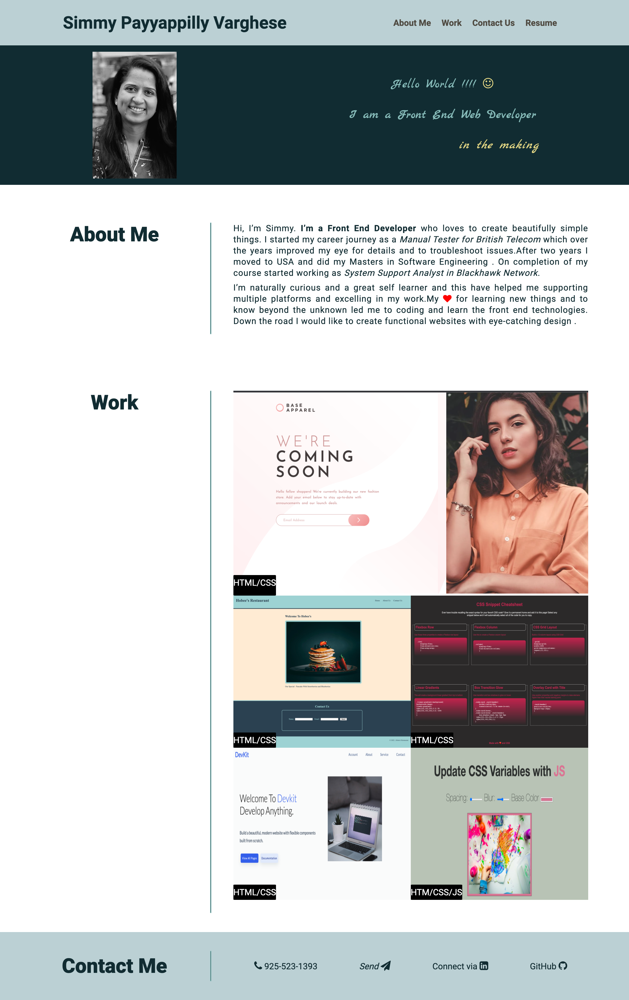

# My Portfolio

## Description
 
My Portfolio Webpage is created using HTMl5 elements and CSS3 including CSS Flexbox and animations.Portfolio Page includes a header with navigation links 
directed to the respective sections and Resume link to download the Resume(PDF file).And main elements the three sections avatar section with portfolio image,about meand work.Footer includes the contact me section includes contaxt info with icons that will navigate to the respective pages.

 

### User Story
* AS AN employer ,I WANT to view a potential employee's deployed portfolio of work samples SO THAT I can review samples of their work and assess whether they're a good candidate for an open position

### Acceptance Criteria
GIVEN I need to sample a potential employee's previous work
* WHEN I load their portfolio THEN I am presented with the developer's name, a recent photo or avatar, and links to sections about them, their work, and how to contact them.
* WHEN I click one of the links in the navigation THEN the UI scrolls to the corresponding section.
* WHEN I click on the link to the section about their work THEN the UI scrolls to a section with titled images of the developer's applications.
* WHEN I am presented with the developer's first application THEN that application's image should be larger in size than the others.
* WHEN I click on the images of the applications THEN I am taken to that deployed application.
* WHEN I resize the page or view the site on various screens and devices THEN I am presented with a responsive layout that adapts to my viewport.
## Links

## Technologies Used

* [x] HTML5
* [x] CSS3

## Screenshot
This is how the portfolio page appear in desktop version

## Reference:
* Animation Reference Tutorial

    https://thoughtbot.com/blog/css-animation-for-beginners

* Downloadable Link Tutorial

    https://www.w3schools.com/howto/howto_html_download_link.asp

* Font Awesome Icons

    https://www.tutorialrepublic.com/font-awesome-icons-classes.php

* Typography

    Google Custom Font : Marck Script ,Roboto

